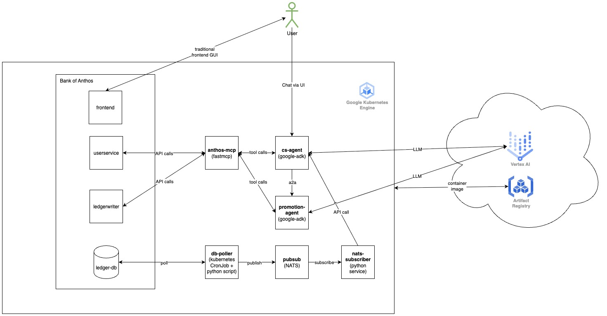

# Meet Your AI Bankers: Next-Gen Bank with AI Employees!

This project forked [Bank of Anthos](https://github.com/GoogleCloudPlatform/bank-of-anthos) by Google Cloud Platform and is the source for the [GKE hackhathon](https://gketurns10.devpost.com/)

## Project Overview

Banking reimagined. Never wait in line and open 24/7! Every question is answered instantly by "AI employees”. This project transforms the classic Bank of Anthos into a next-generation, AI-powered experience. It has conversational agents that handle your banking needs and even credit your account automatically when you qualify for a reward.



## Key Features and Functionality

### 1. Customer Service (CS) AI Agent
- Chat with the Bank AI employee:
  - Users can talk to an AI assistant to do things like check their balance, send money, or manage their contacts. Just like talking in live chat.
- Promotion Help
  - The CS agent is connected to the promotion agent and can also tell users about any special offers or promotions they’re eligible for.

### 2. Promotion Management AI Agent
- Creates Promotions Automatically
  - The system can make custom promotions for users, like “get a bonus when you deposit $1000.”
- Checks If You Qualify
  - It looks at your recent transactions to see if you’ve earned a reward.
- Gives Out Rewards
  - If you qualify, the AI will automatically add the bonus to your account and update your promotion status.

### 3. Event-Driven Architecture
- Instant Reactions
  - Whenever a new transaction happens, the system checks if it affects any promotions.
- Works in the Background
  - This all happens automatically, so users don’t have to do anything extra.

### 4. Model Context Protocol (MCP) Integration
- Standardized AI Tools
  - All banking actions (like checking balances or sending money) are set up as “tools” that the AI can use, making it easy to add new features or connect with other AI systems.

## Technologies Used

### Google Agent Development Kit (ADK)
- Conversational AI Framework
  - Used Google’s ADK to build smart chat agents powered by the Gemini 2.5 Flash model.
- Agent-to-Agent (A2A) Protocol: 
  - The Customer Service Agent and Promotion Agent can talk to each other to get things done.
- Custom Tools
  - Added MCP tools (like “check balance” or “create promotion”) and local function tools that the AI agents can use.
- Web Service with FastAPI
  - Everything runs as a web service, making it easy to manage user sessions and connect with other systems.

### Model Context Protocol (MCP)
- Standardized Tools for AI
  - All banking actions are set up as “tools” that any AI agent can use

### Google Kubernetes Engine (GKE)
- Runs in the Cloud
  - All the AI agents and services are deployed on Kubernetes, making them easy to scale and manage.

### Vertex AI (Large Language Model Provider)
- Smart AI Brains
  - The AI agents use Google’s Gemini 2.5 Flash language model, which is hosted and served through Vertex AI.

### Event-Driven Messaging
- NATS Messaging
  - Uses NATS, a fast messaging system, for transaction notifications.
- Database Poller
  - A small script triggered by Kubernetes' CronJob which regularly checks for new transactions and publish messages to NATS.
- NATS subscriber
  - A service that listens to the transaction events and send request to CS agent to check whether there are users who qualify for promotions, CS agent will delegate the task to promotion agent

## Key Findings and Learnings

### 1. Google Kubernetes Engine (GKE)

- One of the highlights of this project was how smooth it was to move from local development (using kind) to deploying everything on Google Kubernetes Engine (GKE). There is very little friction in deploying to GKE.
- A small issue that I encountered was GKE requires all container images to be hosted in a registry. With kind I could quickly load images from local build

- A key learning is observability, traceability, and logging are essential for apps deployed in Kubernetes. Otherwise debugging and monitoring is extremely difficult

### 2. Google Agent Development Kit (ADK)

- Very easy to get started with. It abstracts away a lot of complexity, making AI agent building fast and simple.
- Includes a built-in UI and supports agent-to-agent (A2A) protocol out of the box.
- Integrates seamlessly with Gemini (Vertex AI).
- Debugging can be challenging when things go wrong, and documentation is a bit limited.  Fortunately, the framework is open source, so reading the code directly was helpful for troubleshooting.


### 3. Vertex AI

- Setting up Vertex AI was straightforward. This is the easiest component to setup. Just needed to create an API key and everything worked out of the box. I think this is also thanks to the Google ADK which make it easier to use Gemini

## How to Run

1. **Set up environment variables**:
   ```bash
   export PROJECT_ID="your-gcp-project-id"
   export REGION="us-central1"
   export VERTEX_API_KEY="your-vertex-api-key"
   export GOOGLE_GENAI_USE_VERTEXAI="TRUE"
   export GOOGLE_API_KEY="your-google-api-key"
   export GOOGLE_PROJECT_ID="your-gcp-project-id"
   export GOOGLE_CLOUD_LOCATION="us-central1"
   ```

2. **Authenticate with Google Cloud**:
   ```bash
   gcloud auth login
   ```

3. **Build and push multi-architecture images**:
   ```bash
   make buildx-all
   ```

4. **Deploy to GKE or local Kubernetes (kind)**:
   ```bash
   make kind-deploy
   ```
   to deploy to kind, you will need to setup the kubectl context to your kind cluster

5. **Access the frontend or the chat UI**

    ```
    kubectl get service frontend | awk '{print $4}'
    ```
    access the frontend at `http://FRONTEND_IP`

    ```
    kubectl get service cs-agent | awk '{print $4}'
    ```
    access the Agent chat UI at `http://AGENT_IP:8080`

